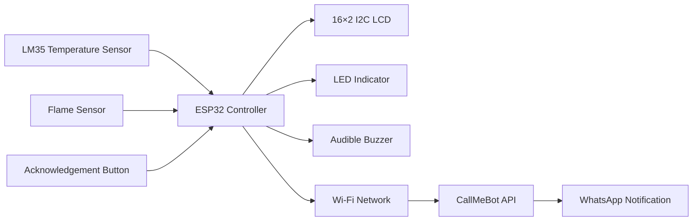

# FireAlert

**ESP32 Fire-Monitoring Prototype**

FireAlert is an educational IoT prototype that monitors temperature and flame-sensor input using an ESP32.

When a configured alert condition is detected, the system activates an LED and buzzer, displays the alert on an I2C LCD, and attempts to send a WhatsApp notification through CallMeBot.

> FireAlert is not certified fire-safety equipment and must not replace approved smoke detectors, alarms, or emergency procedures.

## Features

- LM35 temperature monitoring
- Digital flame-sensor monitoring
- Configurable temperature threshold
- LED and buzzer alarm outputs
- 16×2 I2C LCD status display
- WhatsApp notifications through CallMeBot
- Alarm acknowledgement using a push button
- Automatic Wi-Fi reconnection attempts
- Serial-monitor diagnostic output
- One notification attempt per detected event

## System Architecture



## Hardware

| Component | Purpose |
|---|---|
| ESP32 development board | Main controller and Wi-Fi connectivity |
| LM35 temperature sensor | Analog temperature measurement |
| Flame-sensor module | Digital flame indication |
| 16×2 I2C LCD | Local system status |
| Active buzzer | Audible alert |
| LED and resistor | Visual alert |
| Push button | Alarm acknowledgement |
| Breadboard and jumper wires | Prototype connections |

## Pin Configuration

| Component | ESP32 connection |
|---|---|
| Flame-sensor digital output | GPIO 15 |
| LM35 analog output | GPIO 34 |
| LCD SDA | GPIO 21 |
| LCD SCL | GPIO 22 |
| Buzzer | GPIO 18 |
| LED | GPIO 4 |
| Acknowledgement button | GPIO 14 |

Confirm the voltage requirements and pin arrangement of your specific modules before powering the circuit.

## Software Requirements

- Arduino IDE
- ESP32 board support
- `LiquidCrystal_I2C`
- `UrlEncode`
- ESP32 Wi-Fi and HTTP client libraries

## Installation

### 1. Clone the repository

```bash
git clone https://github.com/Mohamed-Sherif-Ali/FireAlert.git
cd FireAlert
```

### 2. Assemble the prototype

Connect the components according to the pin table.

Before powering the circuit:

- Confirm all ground connections
- Verify sensor pin orientation
- Check the LCD I2C address
- Confirm that connected modules use compatible voltage levels

### 3. Configure notification credentials

Open `fire_alert_system.ino` and locate:

```cpp
const char* WIFI_SSID = "YOUR_WIFI_NAME";
const char* WIFI_PASSWORD = "YOUR_WIFI_PASSWORD";

String PHONE_NUMBER = "1234567890";
String API_KEY = "YOUR_API_KEY_HERE";
```

Replace the placeholder values locally.

Do not commit real Wi-Fi passwords, phone numbers, or API keys to GitHub.

Obtain the phone number and API key according to CallMeBot's current setup instructions.

### 4. Upload the sketch

1. Connect the ESP32 through USB.
2. Select the correct ESP32 board.
3. Select the correct serial port.
4. Upload `fire_alert_system.ino`.
5. Open the Serial Monitor at `115200` baud.

## Current Configuration

The default sketch uses:

| Setting | Default |
|---|---:|
| Temperature alert threshold | 60°C |
| Temperature-reading interval | 500 ms |
| Wi-Fi retry interval | 5 seconds |
| Wi-Fi connection timeout | 20 seconds |
| Alarm auto-shutoff | 60 seconds |
| Button debounce delay | 50 ms |

These values are prototype defaults, not certified safety settings.

Sensor behaviour should be tested and calibrated for the specific hardware and environment.

## How It Works

1. The ESP32 initializes the sensors, LCD, alarm outputs, and Wi-Fi connection.
2. It periodically reads the LM35 temperature value.
3. It continuously checks the digital flame-sensor state.
4. A flame indication or temperature above the configured threshold activates the alarm.
5. The system attempts to send one WhatsApp notification for the event.
6. The user can silence the buzzer using the acknowledgement button.
7. The alarm also stops automatically after the configured timeout.
8. Monitoring continues after the alarm is reset.

## Limitations

- The project has not undergone fire-safety certification.
- The sensors may produce false positives or false negatives.
- Temperature measurements depend on ESP32 ADC behaviour and sensor calibration.
- Flame sensors can be affected by distance, orientation, ambient light, and sensor quality.
- WhatsApp notifications depend on Wi-Fi and an external service.
- Network alerts may be delayed or fail completely.
- Credentials are currently configured directly inside the source file.
- The prototype does not include redundant sensing or backup communication.
- The alarm auto-shutoff may be inappropriate for real safety systems.

## Possible Improvements

- Move credentials into an excluded local configuration file
- Add calibrated temperature conversion
- Store event history locally
- Add MQTT integration
- Add multiple sensor zones
- Add notification retry tracking
- Add backup power monitoring
- Add automated tests for state transitions
- Add a circuit diagram and prototype photographs
- Replace blocking delays with non-blocking state logic

## Safety Disclaimer

FireAlert is an educational and experimental prototype.

It must not be used as the primary or sole method of detecting a fire. It has not undergone regulatory assessment, environmental testing, fault-tolerance testing, or independent safety validation.

Always use certified smoke detectors and fire-alarm equipment installed according to applicable local regulations.

## License

Released under the MIT License. See [LICENSE](LICENSE).

## Author

Mohamed Sherif Ali
